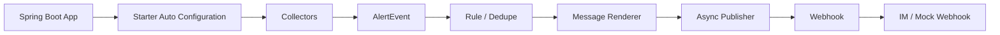

# pcm-prometheus-alert

Spring Boot 告警推送 starter。

## 目标

业务项目只需要引入 starter，配置 webhook，就能先获得：

1. 异常告警
2. 慢请求告警
3. JVM 基础指标告警
4. 基础降噪

## 版本策略

1. 主线优先支持 Spring Boot 2.x
2. 后续兼容 Spring Boot 3.x
3. 长期评估 Spring Boot 1.x

## 总体架构



## 模块规划

1. `pcm-prometheus-alert-core`
2. `pcm-prometheus-alert-spring-boot-starter`
3. `pcm-prometheus-alert-demo`
4. `pcm-prometheus-alert-sql-starter`
5. `pcm-prometheus-alert-prometheus`

## 最小接入

```xml
<dependency>
    <groupId>com.pcm.alert</groupId>
    <artifactId>pcm-prometheus-alert-spring-boot-starter</artifactId>
    <version>0.1.0-SNAPSHOT</version>
</dependency>
```

```yaml
pcm:
  alert:
    enabled: true
    webhook: http://127.0.0.1:8089/mock/webhook
    service-name: demo-service
    environment: local
```

## 本地最小启动

```bash
mvn clean package
java -jar pcm-prometheus-alert-demo/target/pcm-prometheus-alert-demo-0.1.0-SNAPSHOT.jar
```

## Demo 与压测

详细说明见 [docs/11-demo与压测说明.md](docs/11-demo与压测说明.md)。

## 智能体接手

其他智能体继续开发时，先看 [docs/12-其他智能体接手说明.md](docs/12-其他智能体接手说明.md)。
