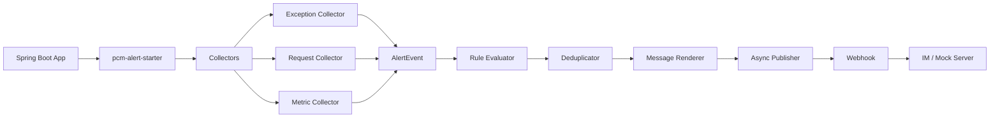

# pcm-prometheus-alert 总体设计方案

## 1. 项目目标

`pcm-prometheus-alert` 是一个面向 Spring Boot 项目的开源公共告警推送组件。

业务项目引入 starter 后，只需要配置 webhook 与少量告警规则，即可在没有 Prometheus、SkyWalking、ELK 等第三方基础设施的情况下，先完成最基础的异常告警、慢请求告警和运行指标告警。后续再逐步扩展到 Prometheus、Alertmanager、慢 SQL、链路追踪和日志平台联动。

## 2. 版本策略

主线优先支持 Spring Boot 2.x。

原因：

1. Spring Boot 2.x 仍是大量 Java 后端项目的主流存量版本。
2. Spring Boot 2.x 使用 `spring.factories` 自动装配，兼容成本可控。
3. Spring Boot 1.x 和 3.x 的差异较大，适合后续做兼容适配层。

推荐兼容策略：

1. MVP：Spring Boot 2.3+，Java 8+。
2. 第二阶段：兼容 Spring Boot 2.0+。
3. 第三阶段：增加 Spring Boot 3.x 自动装配入口。
4. 长期：评估 Spring Boot 1.x 兼容模块，避免拖累主线代码。

## 3. 设计原则

1. 本地最小可用优先：只依赖 Spring Boot + webhook 即可跑通。
2. 采集、规则、降噪、渲染、发送分层设计。
3. 核心模块不依赖 Spring，starter 模块负责接入 Spring。
4. 告警发送异步化，发送失败不影响业务请求。
5. 配置默认保守，未配置 webhook 时只写日志。
6. 不默认绑定 Dubbo、SkyWalking、ELK、Prometheus、公司内部平台。
7. 扩展能力通过独立模块或 SPI 加入。

## 4. MVP 范围

第一阶段只实现最小闭环：

1. Spring Boot starter 自动装配。
2. Webhook 告警推送。
3. MVC 异常告警。
4. 慢请求告警。
5. JVM 基础指标告警。
6. 基础告警降噪。
7. Demo 模块和本地验证接口。

不要求第一阶段接入：

1. Prometheus Server。
2. Alertmanager。
3. SkyWalking。
4. ELK。
5. Dubbo。
6. 复杂动态规则中心。

## 5. 总体架构



## 6. 推荐模块划分

```text
pcm-prometheus-alert
├── pcm-prometheus-alert-core
├── pcm-prometheus-alert-spring-boot-starter
├── pcm-prometheus-alert-demo
├── pcm-prometheus-alert-sql-starter
└── pcm-prometheus-alert-prometheus
```

第一阶段必须实现：

1. `pcm-prometheus-alert-core`
2. `pcm-prometheus-alert-spring-boot-starter`
3. `pcm-prometheus-alert-demo`

第二阶段再实现：

1. `pcm-prometheus-alert-sql-starter`
2. `pcm-prometheus-alert-prometheus`

## 7. 运行链路

1. 应用启动。
2. starter 读取 `pcm.alert.*` 配置。
3. 自动装配 `AlertManager`、`AlertPublisher`、采集器。
4. 请求进入业务系统。
5. 采集器产生 `AlertEvent`。
6. `AlertManager` 执行规则判断。
7. `AlertDeduplicator` 判断是否允许发送。
8. `AlertMessageRenderer` 渲染消息。
9. `AsyncAlertPublisher` 异步投递。
10. `WebhookAlertPublisher` 调用 webhook。

## 8. 告警事件类型

MVP 类型：

1. `EXCEPTION`：异常告警。
2. `SLOW_REQUEST`：慢请求告警。
3. `JVM_MEMORY`：JVM 内存告警。
4. `CPU_USAGE`：CPU 使用率告警。
5. `THREAD_COUNT`：线程数告警。

后续类型：

1. `SLOW_SQL`
2. `DATASOURCE`
3. `PROMETHEUS`
4. `LOG_PATTERN`
5. `CUSTOM`

## 9. 非目标

第一阶段不做：

1. 告警 UI 控制台。
2. 自研 Prometheus。
3. 自研日志平台。
4. 多租户权限。
5. 分布式规则中心。

