# 详细设计说明

## 1. 核心目标

第一阶段的目标不是做全功能监控平台，而是做一个可直接接入的最小告警组件。

最小闭环：

1. 业务系统引入 starter。
2. 配置 webhook。
3. 发生异常、慢请求或基础指标异常。
4. 生成告警事件。
5. 推送到 IM webhook。

## 2. 核心对象关系

```mermaid
classDiagram
    class AlertEvent {
        +String eventId
        +AlertType type
        +AlertLevel level
        +String serviceName
        +String environment
        +String summary
        +String detail
        +long costMs
    }
    class AlertRule {
        +String ruleId
        +boolean enabled
        +AlertType type
        +long threshold
        +long cooldownSeconds
    }
    class AlertManager {
        +onEvent(AlertEvent)
        +recover(AlertEvent)
    }
    class AlertRuleEvaluator {
        +shouldAlert(AlertEvent)
    }
    class AlertDeduplicator {
        +allow(AlertEvent)
        +record(AlertEvent)
    }
    class AlertMessageRenderer {
        +render(AlertEvent)
    }
    class AlertPublisher {
        +publish(AlertMessage)
    }

    AlertManager --> AlertRuleEvaluator
    AlertManager --> AlertDeduplicator
    AlertManager --> AlertMessageRenderer
    AlertManager --> AlertPublisher
    AlertManager --> AlertEvent
    AlertEvent --> AlertType
    AlertEvent --> AlertLevel
    AlertRule --> AlertType
```



## 3. 核心类设计

### 3.1 `AlertManager`

职责：

1. 接收统一事件。
2. 做规则判断。
3. 做去重和冷却。
4. 调度消息渲染和发送。

建议方法：

```java
public void onEvent(AlertEvent event)
public void recover(AlertEvent event)
public boolean isRecoverable(AlertEvent event)
```

### 3.2 `AlertEventFactory`

职责：

1. 把框架对象转换成统一事件。
2. 保持采集器只负责采集，不负责格式化。

建议方法：

```java
public static AlertEvent fromException(Throwable ex, HttpServletRequest request)
public static AlertEvent fromSlowRequest(HttpServletRequest request, long costMs)
public static AlertEvent fromMetric(String metricName, double value)
```

### 3.3 `WebhookAlertPublisher`

职责：

1. 构造 webhook 请求体。
2. 发送 POST 请求。
3. 超时失败后写日志，不抛出到业务链路。

建议方法：

```java
public void publish(AlertMessage message)
protected Map<String, Object> buildRequest(AlertMessage message)
protected String resolveWebhook(AlertMessage message)
```

### 3.4 `SimpleAlertDeduplicator`

职责：

1. 按 key 去重。
2. 控制冷却时间。
3. 控制窗口内重复次数。

建议 key 组成：

1. `type`
2. `serviceName`
3. `summary`
4. `requestPath`

### 3.5 `AlertMessageRenderer`

职责：

1. 将 `AlertEvent` 渲染成 webhook 需要的统一消息格式。
2. 保证消息字段短小清晰。

建议内容：

1. 标题
2. 服务名
3. 环境
4. 时间
5. 摘要
6. 详情
7. traceId

## 4. 详细链路

### 4.1 异常告警链路

1. 业务请求进入 Spring MVC。
2. `HandlerExceptionResolver` 或 `@ControllerAdvice` 捕获异常。
3. 构造 `AlertEvent(EXCEPTION)`。
4. `AlertManager` 判断是否允许。
5. `SimpleAlertDeduplicator` 去重。
6. `WebhookAlertPublisher` 推送。

### 4.2 慢请求告警链路

1. 请求过滤器记录开始时间。
2. 请求完成后计算耗时。
3. 超过阈值则构造 `AlertEvent(SLOW_REQUEST)`。
4. 进入统一告警链路。

### 4.3 指标告警链路

1. 定时任务采样 JVM、CPU、线程。
2. 采样值超阈值则构造事件。
3. 进入统一告警链路。

## 5. 配置设计

推荐配置结构：

```yaml
pcm:
  alert:
    enabled: true
    webhook: http://127.0.0.1:8089/mock/webhook
    service-name: demo-service
    environment: local
    request:
      enabled: true
      slow-threshold-ms: 1000
    exception:
      enabled: true
    metric:
      enabled: true
      interval-seconds: 30
    dedupe:
      enabled: true
      cooldown-seconds: 300
```

## 6. 本地最小实现方案

不依赖 Prometheus、SkyWalking、ELK 时，先做以下内容：

1. Spring MVC 过滤器采集请求耗时。
2. 全局异常处理器采集异常。
3. `@Scheduled` 轮询 JVM 指标。
4. Webhook 客户端发送告警。
5. demo 模块提供 mock webhook 接收器。

这套方案就是第一阶段要先跑通的最小实现。

